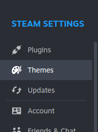
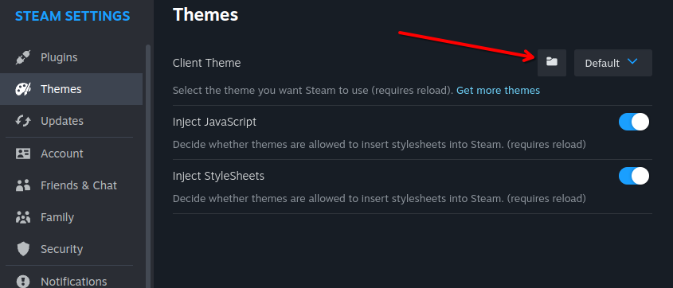

# Getting Started   

Once Millennium is installed, you can find its related settings within the Steam user interface. 

# Themes

To select a theme for your Steam Client to use, select one from the dropdown in the "Themes" tab within settings. 

If you don't already have any themes, you'll need to install some. Head over to https://steambrew.app/themes and pick out some themes you like.

## Installing Themes

1.  Open your themes folder using the folder button in the Steam      interface; We'll use this in a later step.

    

1. Download the theme you want from https://steambrew.app/themes, and store it somewhere you'll remember. 

1. Move/Copy the theme zip you downloaded in the previous step into the skins folder you opened in step one. On a normal steam installation, it would be `C:\Program Files (x86)\Steam\steamui\skins` however it may vary depending on your installation.

1. Extract the theme zip inside the skins directory from the last step.

1. Select the theme from the "Client Theme" drop down inside steam.

:::note
If your new theme doesn't show in the drop down list, make sure it's in the proper directory, is extracted, and has a `skin.json` in the root directory of extracted skin (i.e `C:\Program Files (x86)\Steam\steamui\skins\Theme\skin.json` instead of `C:\Program Files (x86)\Steam\steamui\skins\Theme\Theme\skin.json`)
:::

# Plugins 

As of 6/11/2024, plugins don't quite yet have proper support. The only supported plugin is the pre-installed plugin "Millennium". We hope to have proper support in the near future! Stick around for development, or contribute if you'r tech savvy!

# Updates

The updates panel is a simple updater for your installed themes. You can select which themes you want to update from the latest publish version.